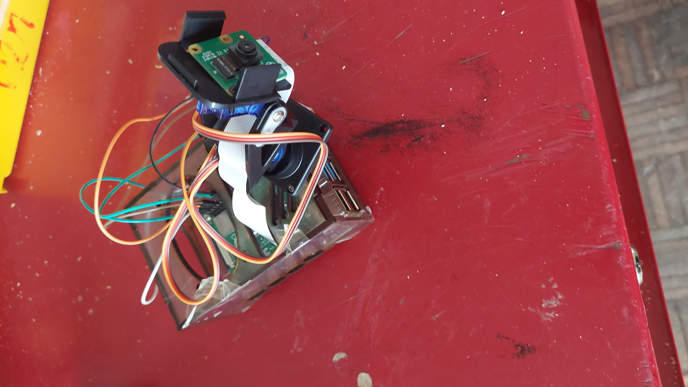
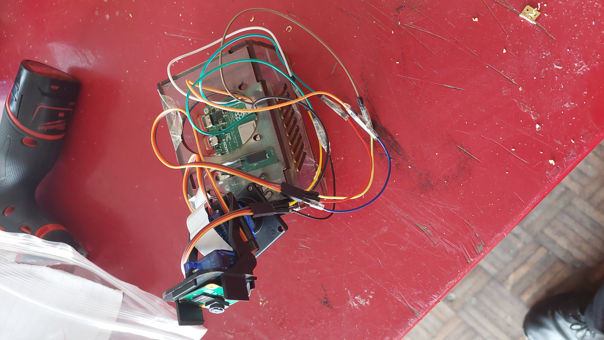
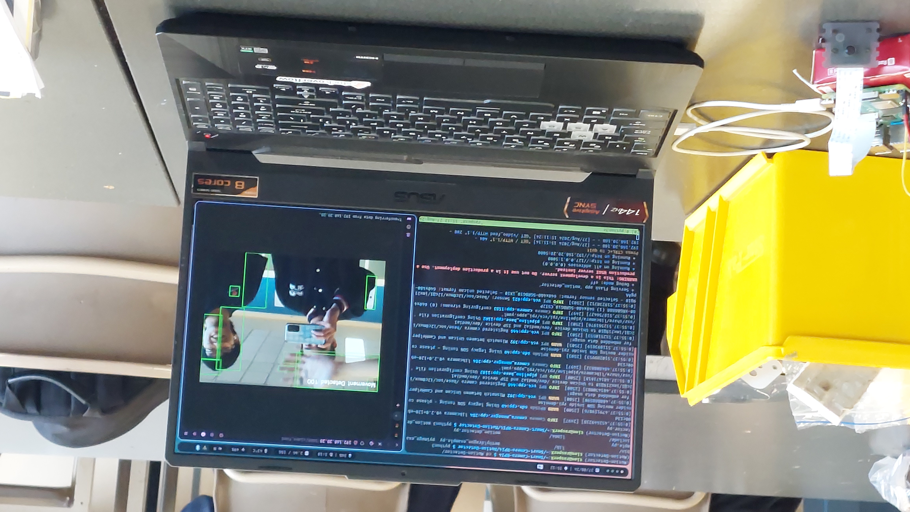

<h1 style="text-align: center;">Smart Camera with RPi4</h1>

<h2>Smart Camera System Overview - Year 12 System Engineering Project</h2>

  The project involves creating a Smart Camera system that detects motion and streams video over a local network, while sending real-time notifications via Gmail. Using a Raspberry Pi 4 paired with a Pi Camera v2, the system leverages Python libraries such as OpenCV for motion detection, PiCamera2 for camera control, and Flask to serve the video stream. When motion is detected, the system captures and streams the video, providing a real-time feed accessible within the network, and simultaneously sends alert notifications through Gmail, ensuring immediate awareness of any detected activity. - ChatGPT

<h2>References</h2>
<ul>
  <li><a href="https://github.com/raspberrypi/picamera2">Picamera2 Library</a></li>
  <li><a href="https://github.com/justsaumit/opencv-face-recognition-rpi4">justsaumit's opencv-face-recognition-rpi4</a></li>
  <li><a href="https://github.com/methylDragon/opencv-motion-detector/">methylDragon's motion-detector</a></li>
  <li><a href="https://medium.com/@bergamasco.florian/yolo-raspberry-pi-how-to-create-a-smart-camera-3f7783420751">Automatic Email Notification</a></li>
  <li><a href="https://www.youtube.com/watch?v=T_892SKVNf4">AutoFollow Motion Tracker with PanTilt Mechanism</a></li>
  <li><a href="https://www.the-diy-life.com/how-to-design-a-pi-case-for-laser-cutting-in-depth-tutorial/">Raspberry Pi 4's Case</a></li>
</ul>
